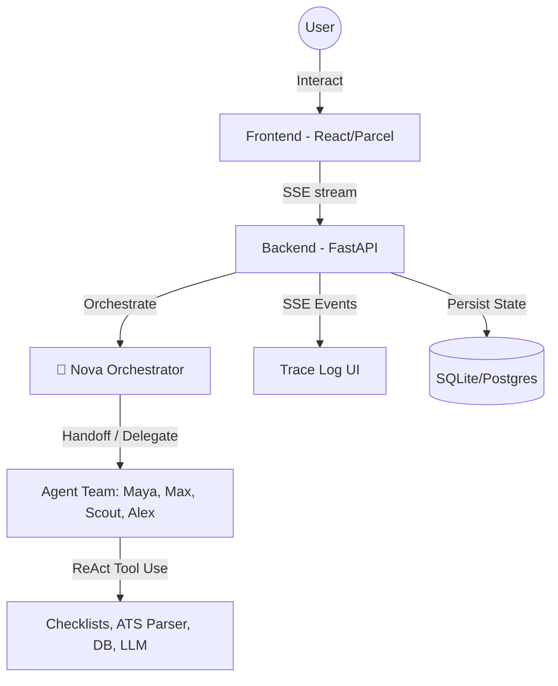

# SmartResume — Multi-Agent Career Placement Hub

SmartResume is a premium, open-source platform that helps job seekers optimize their resumes, prep for interviews, track applications, and match with jobs. 

It features a collaborative **Multi-Agent Orchestration Team** that simulates a full career placement agency, guiding you from initial resume analysis to final interview prep.

---

## 🎯 Overall Objective

SmartResume is designed to be a complete career placement hub. By utilizing an advanced ReAct reasoning loop, the platform breaks down complex career placement tasks into smaller, manageable actions distributed among domain-specific AI agents, all coordinated by a central orchestrator.

---

## 🚀 Key Features

*   **🧠 Collaborative Multi-Agent System (Nova & Team)**:
    *   **Nova (Orchestrator)**: Uses a ReAct reasoning loop to classify user intent, trigger workflows, delegate tasks to specialists, and synthesize the final guidance.
    *   **Maya (Resume Analyst)**: Scans for ATS formatting issues, keyword density gaps, structure flaws, and matches resumes against targeted jobs.
    *   **Max (Content Writer)**: Generates one-click bullet point rewrites, custom cover letters, and tailored professional summaries.
    *   **Scout (Job Hunter)**: Matches your profile with real-time job openings and handles application tracking pipelines.
    *   **Alex (Career Coach)**: Creates step-by-step career path roadmaps, custom DSA checklists, and interactive mock interview prep.
*   **⚡ Real-Time SSE Stream & Trace Log**: Fully transparent Server-Sent Events (SSE) stream showing the real-time collaboration trace of the agent team as they invoke tools and execute tasks.
*   **🎨 Neo-Brutalist Aesthetic**: Handcrafted dark/cream design system using CSS grid backgrounds, zero-radius borders, hard drop shadows, Playfair Display typography, and interactive micro-animations matching the landing page.
*   **🛠️ Robust Career Dashboard**:
    *   **Resume Lab**: Direct drag-and-drop feedback.
    *   **Job Tracker**: Kanban board for application tracking.
    *   **Learning Hub**: Custom generative AI roadmaps and DSA progress checklists.
    *   **Resume Builder**: Form-to-PDF compiler for exports.
*   **💳 Subscription Tiers**: Three tiers of service (FREE, EARLY_BIRD, PRO) that cater to different user needs, ensuring seamless transition after upgrade.

---

## 🏗️ System Architecture



The platform follows a decoupled architecture:
- **Frontend (React 18 / Parcel):** A Single Page Application utilizing `react-router-dom`. It displays the dashboard and connects to the backend via SSE to render a real-time trace log.
- **Backend (Python / FastAPI):** Handles orchestration, LLM interactions, and data persistence. It streams the agent reasoning directly back to the client.

---

## 🤖 The Multi-Agent System

The core of SmartResume is coordinated via an in-memory Message Bus. The team consists of five distinct agents, each strictly adhering to specialized roles to prevent task overlap. Data and context sharing is seamlessly injected via `shared_context["previous_results"]` directly into LLM prompts.

### 🧠 Nova (The Orchestrator)
**Role:** Project Manager
- **Responsibilities:** Classifies user intent, triggers predefined workflows (like `full_review` or `end_to_end_journey`), and routes requests to the appropriate specialists.
- **Constraints:** Nova DO NOT perform domain tasks directly; her ONLY job is delegation and synthesis.

### 🔍 Maya (Resume Analyst)
**Role:** ATS and Structure Expert
- **Responsibilities:** Scans resumes for structural flaws, ATS formatting, and keyword density.
- **Constraints:** Maya MUST focus solely on analysis and MUST NEVER rewrite content.

### ✍️ Max (Content Writer)
**Role:** Copywriting Specialist
- **Responsibilities:** Generates and rewrites bullet points, professional summaries, and cover letters.
- **Constraints:** Max MUST focus strictly on writing and MUST NEVER evaluate or score resumes.

### 🎯 Scout (Job Hunter)
**Role:** Job Matching and Tracking
- **Responsibilities:** Sources real-time job openings and matches them with the user's profile.

### 🧭 Alex (Career Coach)
**Role:** Strategic Advisor
- **Responsibilities:** Creates custom career roadmaps, interview prep checklists, and strategy.
- **Constraints:** Alex MUST NEVER format resumes or perform job searches directly.

### Inter-Agent Communication
Agents communicate using `backend/agents/message_bus.py`, which supports sending requests, sharing context, and coordinating complex workflows without dropping information.

---

## 🛠️ Technology Stack
### Frontend
- **Framework**: React 18
- **Build Pipeline**: Parcel (zero-config bundler)
- **Styling**: Vanilla CSS + Tailwind v4 base layer (Neo-brutalist theme)
- **Icons**: Lucide React

### Backend
- **Framework**: FastAPI (Python)
- **Database / ORM**: SQLite (dev) / Neon PostgreSQL (prod) + SQLAlchemy
- **Streaming Protocol**: Server-Sent Events (SSE)
- **AI Integration**: Groq API (Llama 3.3 70B) & Google Gemini (GenAI SDK)
- **Orchestration**: Custom ReAct agent loop framework with state persistence

---

## ⚙️ Setup & Installation

### Prerequisites
*   Node.js (v18+)
*   Python (3.10+)
*   Git

### 1. Clone & Prepare
```bash
git clone https://github.com/Abhiii47/Resume.git
cd Resume
```

### 2. Code Quality & Formatting (Optional)
To maintain code consistency before committing, run the following formatters:

```bash
# Backend (Python)
cd backend
pip install black isort flake8
isort . && black . --line-length 120
flake8 . --select=E9,F63,F7,F82 --show-source --statistics

# Frontend (React)
cd frontend
npm install
npm run lint # Custom eslint configuration
```

### 3. Backend Setup
Navigate to the `backend/` directory, set up a virtual environment, and install all required libraries:

```bash
cd backend
python -m venv venv

# Activate Virtual Env (Windows):
venv\Scripts\activate
# Activate Virtual Env (Mac/Linux):
source venv/bin/activate

# Install dependencies
pip install -r requirements.txt
```

**Environment Config**:
Create a `.env` file inside `backend/`:
```env
DATABASE_URL=sqlite:///./sql_app.db
SECRET_KEY=your_secure_random_key_here
ALGORITHM=HS256
ACCESS_TOKEN_EXPIRE_MINUTES=1440

# LLM Providers (At least one must be valid)
GROQ_API_KEY=your_groq_api_key
GEMINI_API_KEY=your_gemini_api_key
```

**Launch Backend**:
```bash
python main.py
```
The server will run on `http://localhost:8000` with interactive Swagger docs at `/docs`.

### 4. Frontend Setup
Open a new terminal, navigate to the `frontend/` directory, and start the development server:

```bash
cd frontend
npm install
npm run dev
```
The client dashboard will be available at `http://localhost:3000`.

---

## 🤝 Contributing

We welcome contributions! Please fork the repository and submit a Pull Request.

---

## 📄 License

This project is licensed under the MIT License.
